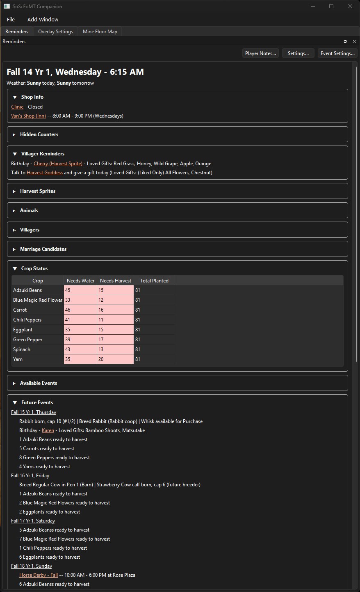
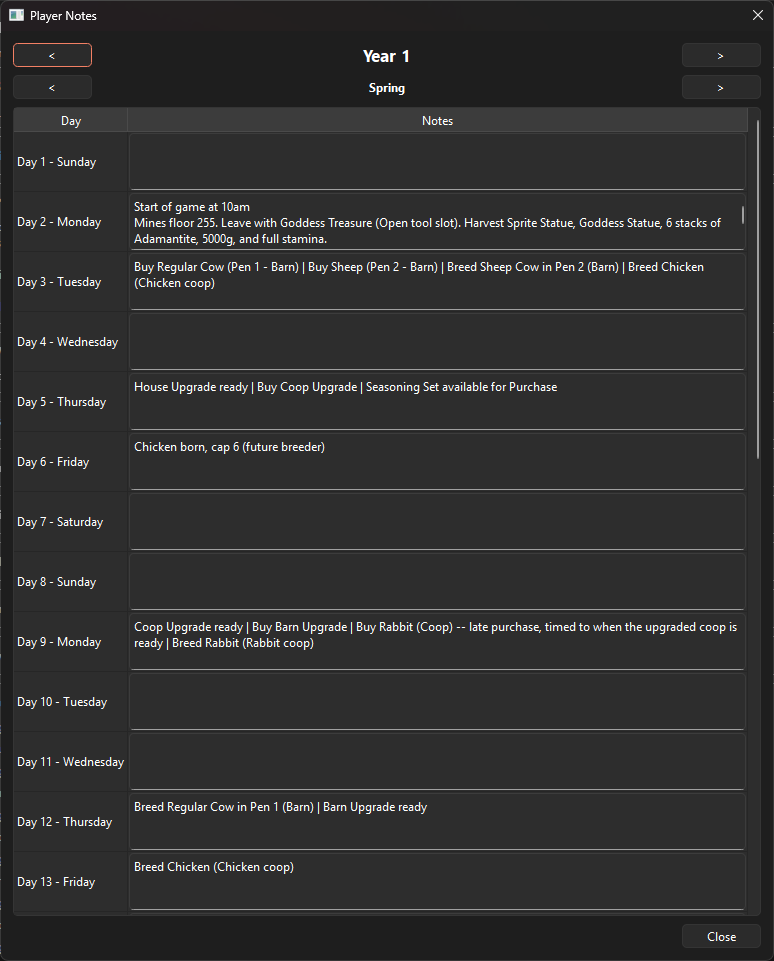
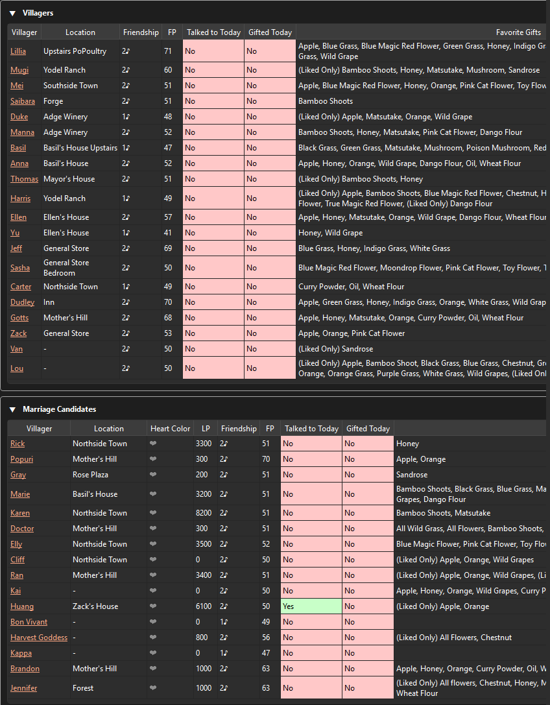
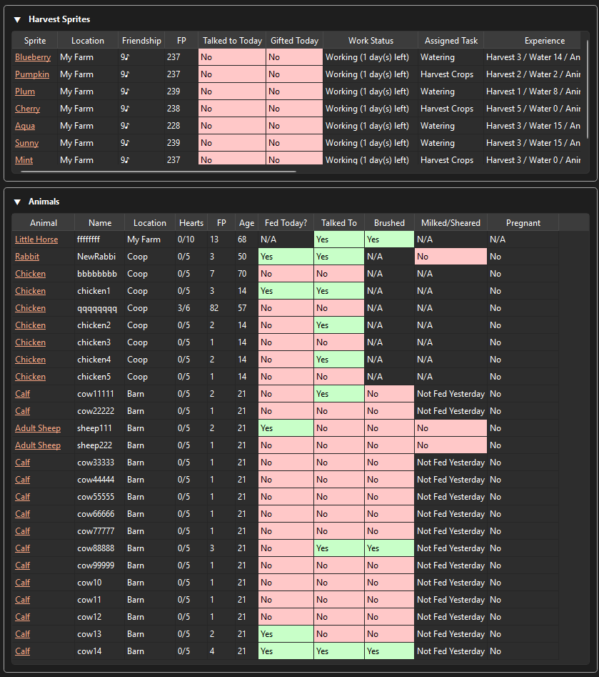
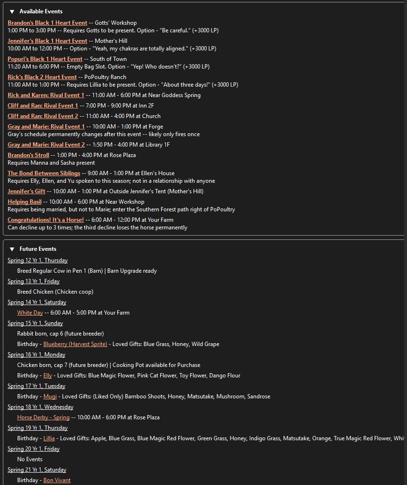
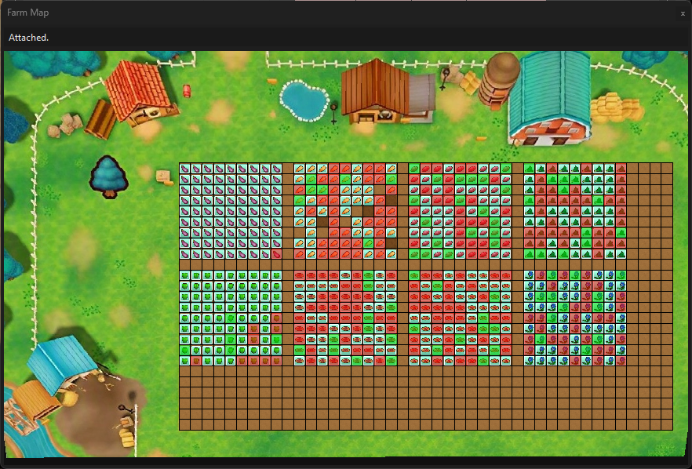
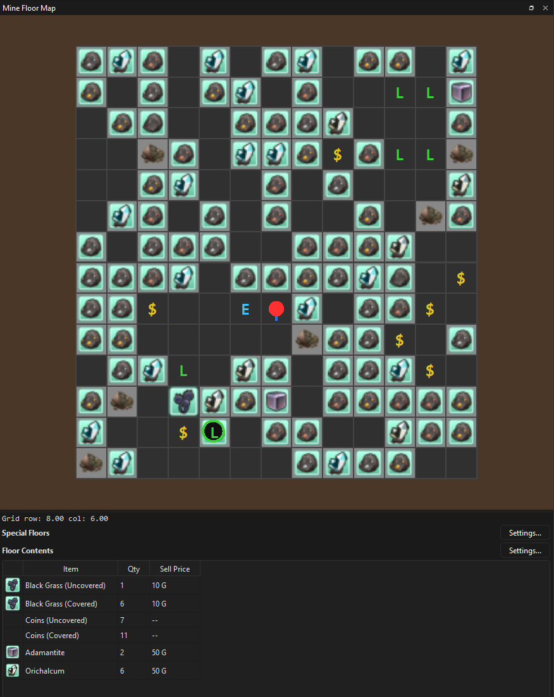
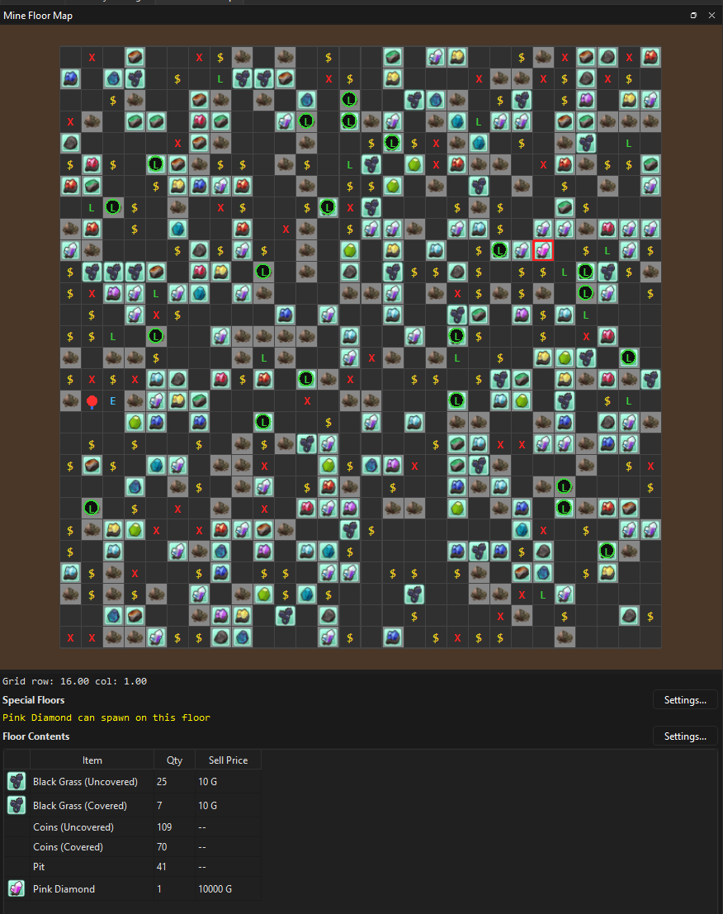
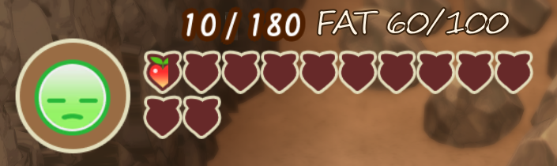
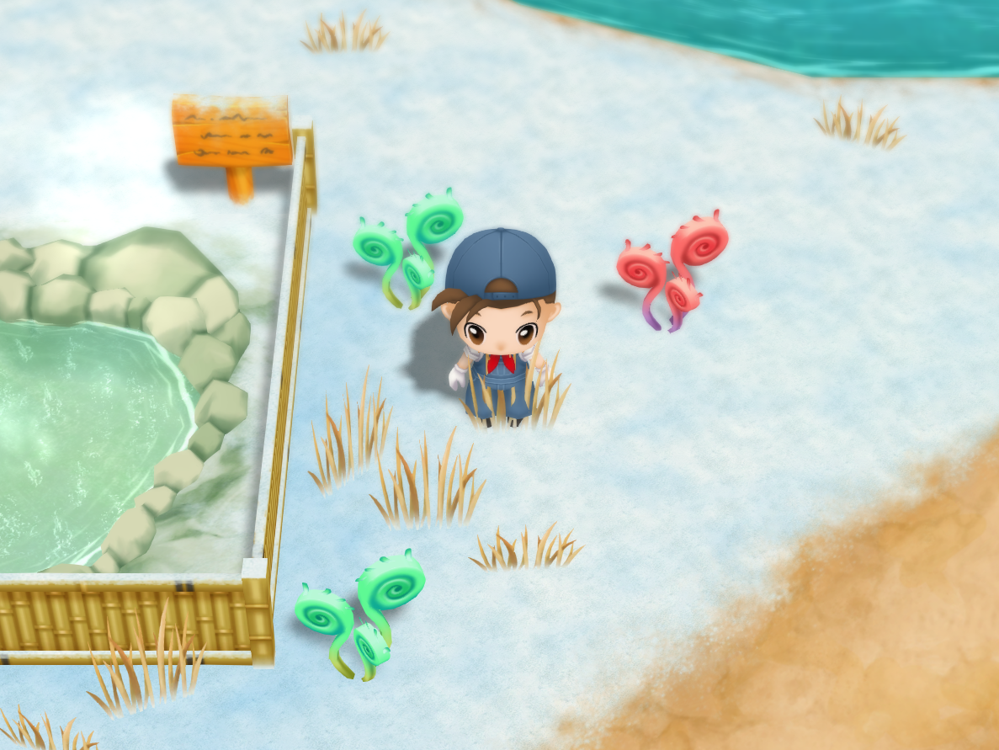

# SoS: FoMT Companion App

A companion app for **STORY OF SEASONS: Friends of Mineral Town** (Steam) that shows live
in-game information — friendship levels, stamina, money, time/weather, crop status, mine maps,
and more — alongside the game as you play. Includes an optional overlay mode that displays chosen
values directly over the game window.

This is a fan-made tool built for personal/offline single-player use. It is not affiliated with,
endorsed by, or produced with the involvement of Marvelous or XSEED.

## Download

Grab the latest `.zip` from the [Releases](../../releases) page, extract it anywhere, and run
`SoS-FoMT-Companion.exe` inside the extracted folder — no install, no Python required. Keep the
whole extracted folder together; the `.exe` needs the other files next to it.

> **Heads up on antivirus warnings:** this app reads live values out of the game's memory while
> you play (the same general technique tools like Cheat Engine use). That behavior is exactly what
> antivirus software and Windows SmartScreen are trained to flag, so you may see a warning when you
> first run it. This is a known false positive for tools built this way — if you'd rather verify
> for yourself, the full source code is right here in this repo, or download from the Releases
> page and inspect it before running.

## Features

- Live values: friendship/heart levels, stamina, money, time & weather, tool EXP, mine depth
- Interactive Farm Map and Mine Map with live player position
- Villager, Animal, and Marriage Candidate viewers
- A Reminders dashboard: festivals, birthdays, shop hours, crop watering/harvest status, and more
- A lightweight always-on-top overlay for showing a chosen value directly over the game
- A handful of optional single-player cheats (all off by default, toggled in File → Cheats...)

## Screenshots

**Reminders** — today's events, shop hours, crop status, and a day-by-day lookahead



**Player Notes** — a personal per-day notebook, shown right alongside the other reminders



**Villagers, Marriage Candidates, Harvest Sprites & Animals**




**Available & Future Events** — upcoming heart events, festivals, and harvest/breeding milestones



**Farm Map** — live crop growth and watering status overlaid on your farm



**Mine Floor Map** — live floor contents, and a heads-up when a rare spawn (like a Pink Diamond) is on the current floor




**Overlay** — a chosen value shown directly over the game window



**Optional cheats** — off by default; example shown is Guaranteed Ground Item Spawn



## Requirements

- Windows
- STORY OF SEASONS: Friends of Mineral Town on Steam, running while you use the app

## Running from source

If you'd rather run it from source instead of the packaged `.exe`:

```
pip install -r requirements.txt
python -m app.main
```

Requires Python 3.11+.

## License

MIT — see [LICENSE](LICENSE).
